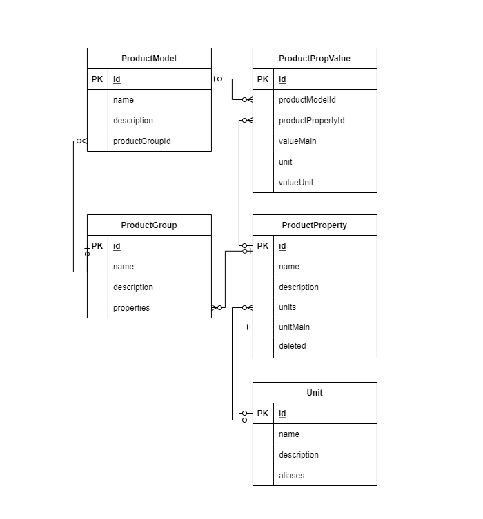

# API

## ER-диаграмма связанных сущностей

## Описание сущности ProductProperty, свойства товара

1. id
2. name - название
3. description - описание
4. units - список Id Единиц измерений
5. unitMain - id основной ЕИ
6. deleted - флаг

## Функции (эндпониты)

1. CRUD (create, read, update, delete) для ProductProperty
    1. create
    2. read по id
    3. update по id
    4. delete, установка флага deleted.